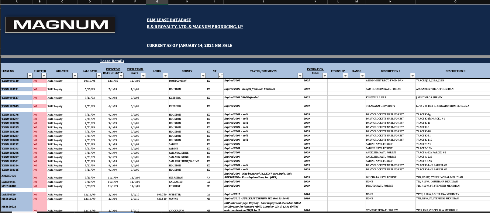
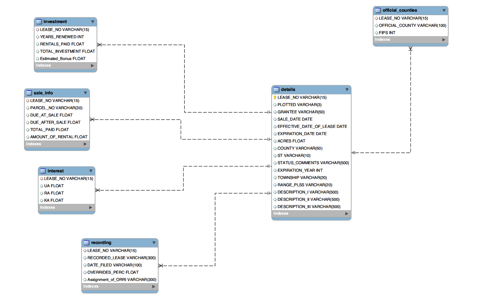
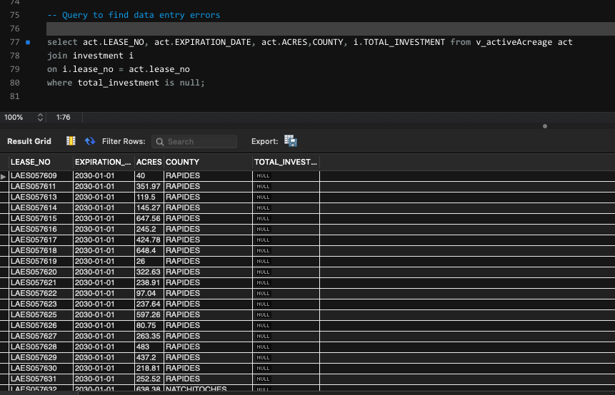

# Magnum AWS Lease MySQL DB

# Project Goal
Extract company federal lease records from source data (excel sheet), clean, and load into cloud MySQL database on AWS.  Run routine queries and request data entry team to fix errors caused from spreadsheet mismanagement.  Finally, create a Tableau dashboard to connect to the database for visualizing lease data.

<br>

# Libraries & Code
1. Python 3.7
2. MySQL 8.0.23
3. Pandas, PyMySql

<br>


# Data & Script Details

## Data
1.  Source data is an Excel sheet containing an unsantiized table holding company federal lease records dating back to 1995
    * Primary lease identifier is the Lease Number issued by the BLM (Bureau of Land Management)
    * Create data tables in SQL to split up large table found in spreadsheet

<br>

### Source Data Preview



<br>

### Data Model (EER Diagram)



<br>
<hr>
<br>

## Scripts
<br>


### Python 
<hr>

1.  Dataclean.py
    * Read source data from Excel format
    * Clean data by:
        * Drop rows with null serial numbers
        * Convert date fields to datetime, then convert back to string with 'YYYY/MM/DD" format
        * Convert Panda NaN's and blank string values to none type to properly insert into SQL database as NULL

2.  etl.py
    * Write functions to retrieve database column names, generate dynamic insert sql statements with formatted strings, and insert into table through batch loads or record by record
    
    * Insert into table function designed to handle updating rows upon duplicate primary key

    * For batch inserting and better performance, executemany function is used when tables are empty
        
3.  datamap_config.py
    * File holds 2 dictionaries
        1. Keys are table names from database and values are source data column names
        2. Parse information for Source Data excel sheet 
            * (columns to use, header row, sheet name, etc)

4. db_config.py
    * Holds dictionary to pass in connection details to AWS database

5. Scratch Sheet Script.ipynb
    * First runs of development code within 1 script for debugging and quality control

<hr>

### SQL

1.  createTables.sql
    * SQL script to initialize tables
2.  createViews.sql
    * SQL script to create frequently used table queries
3.  Stored_Procedures
    * SQL file to hold common queries
4. dropTables
    * SQL script to quickly drop tables if database needs to be repopulated from scratch

<br>

# Screenshots of Work Related Applications
<br>

## Queries after Loaded Data - Example Query to Send to Data Entry Team
* Ask team to fix null investment rows
<br>



<br>
<hr>
<br>

## Tableau Connected to Database Info for Reporting
- Report to Show Managment Expiration Schedule and Investment in Specific County


<br>
<br>


# Dynamic ETL Code Snippets

```python
def getDBcolumnNames(table_name, db_connection):
    ''' This function will get column names from desired table in its ordinal position by passing sql query.
        This function will only work when already connected to desired database
    '''

    #sql statement to get column names
    schemasql = '''
    SELECT *
    FROM INFORMATION_SCHEMA.COLUMNS
    WHERE TABLE_NAME = '{}'
    ORDER by ordinal_position;
    '''.format(table_name)

    cursor = db_connection.cursor()

    #executing sql statement and then fetching data from cursor
    cursor.execute(schemasql)
    dbcolumns = cursor.fetchall()

    #retreiving column name from cursor along with ordinal position
    sql_col_name = []

    for item in dbcolumns:
        # item 3 is where col name is found in data fetch object
        sql_col_name.append(item[3])

    #joining list of columns by comma and converting to string
    stringcolnames = ','.join(sql_col_name)

    print('Column Names in Database for Table {}'.format(table_name))
    print('----------------')

    return stringcolnames

####### Generate Insert Sql String ##########


def generateInsertString(table_name, db_connection, update=True):
    '''This function will generate an insert SQL statement
        The file where the function is being called must be connected to a database for function to execute,
        the connection object must be passed in to this function
    '''

    cols = getDBcolumnNames(table_name, db_connection)

    #initalizing empty string
    valueplaceholders = ''

    #for loop to generate placeholder %s
    #splitting string column names by comma to get number of columns
    for i in range(0, len(getDBcolumnNames(table_name, db_connection).split(','))):
        valueplaceholders += '%s,'
    # taking string minus 1 position to remove extra comma
    valueplaceholders = valueplaceholders[0:len(valueplaceholders)-1]

    #final insert string, placeholders will table name, columns from db, and values from datasource/dataframe
    insert_sql = 'INSERT INTO {}({}) VALUES ({})'.format(
        table_name, cols, valueplaceholders)

    # if update is false, then this code to check for duplicate keys and update will not be added to sql string
    if update:
        updatestring = []
        for col in getDBcolumnNames(table_name, db_connection).split(','):
            updatestring.append('{} = %s'.format(col))

        updatestring = ','.join(updatestring)

        insert_sql = insert_sql + ' ON DUPLICATE KEY UPDATE ' + updatestring

    return insert_sql


```